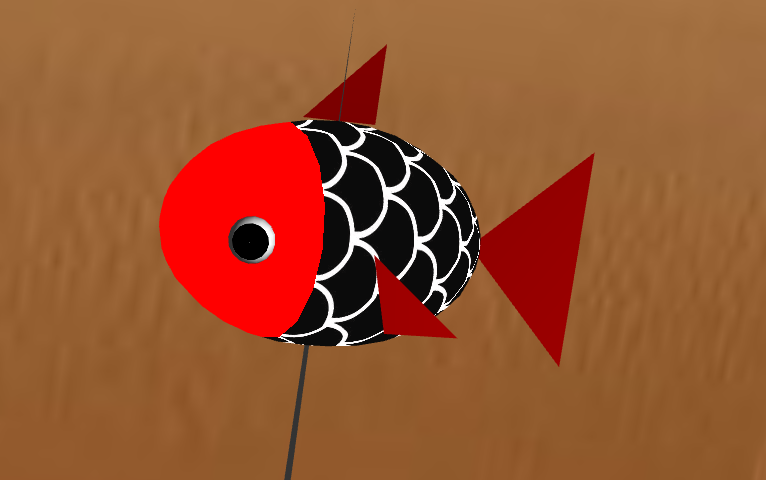
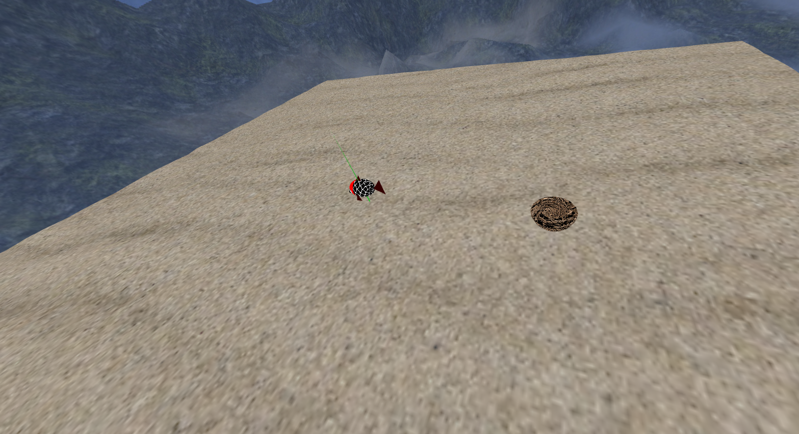
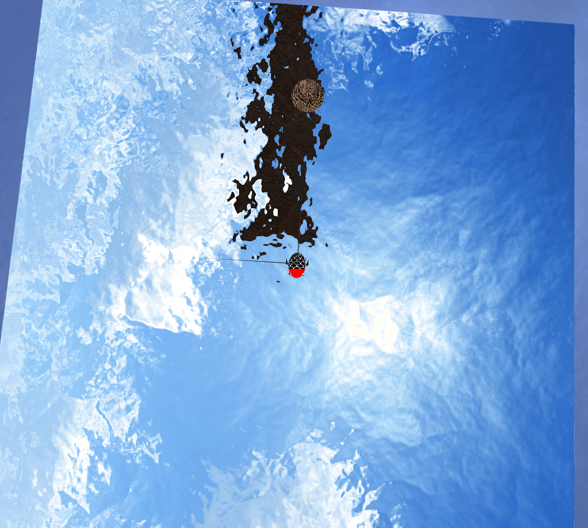
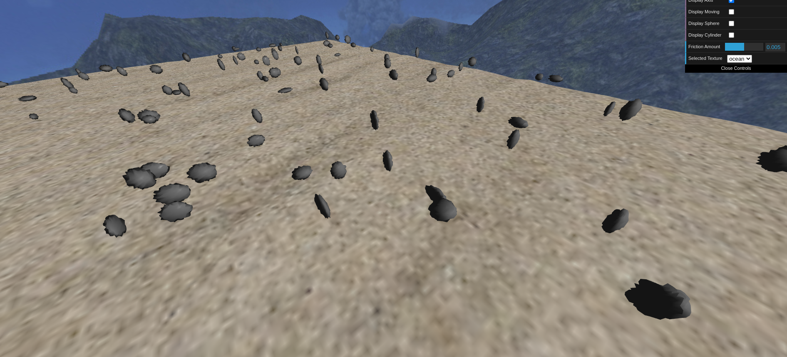
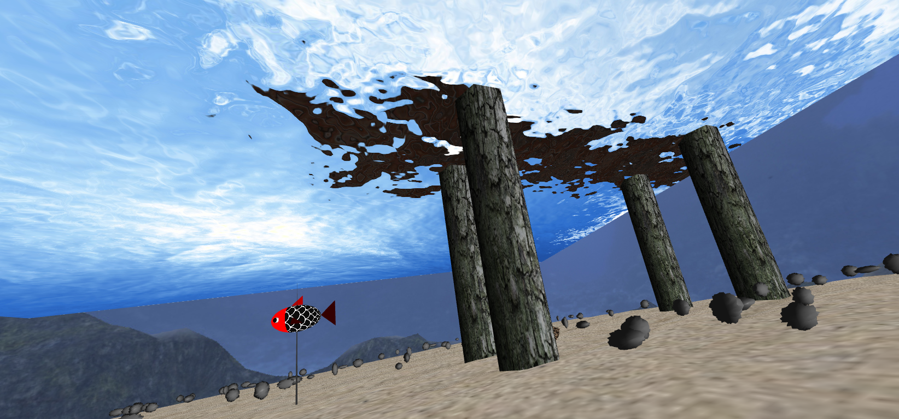
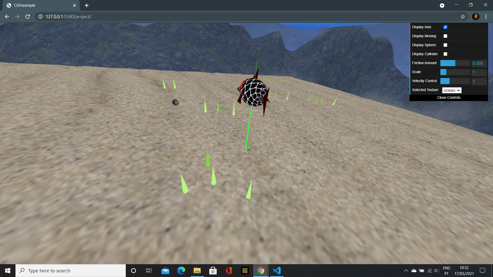
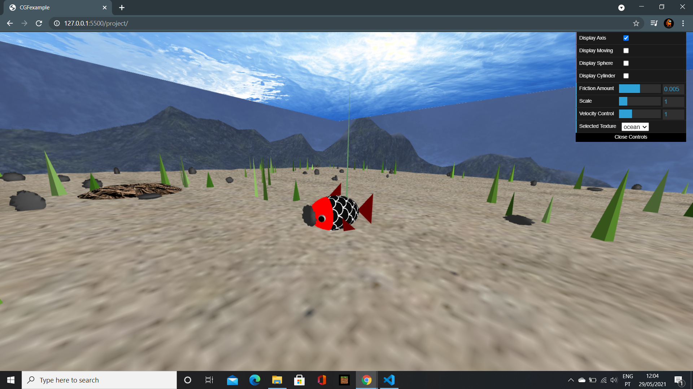
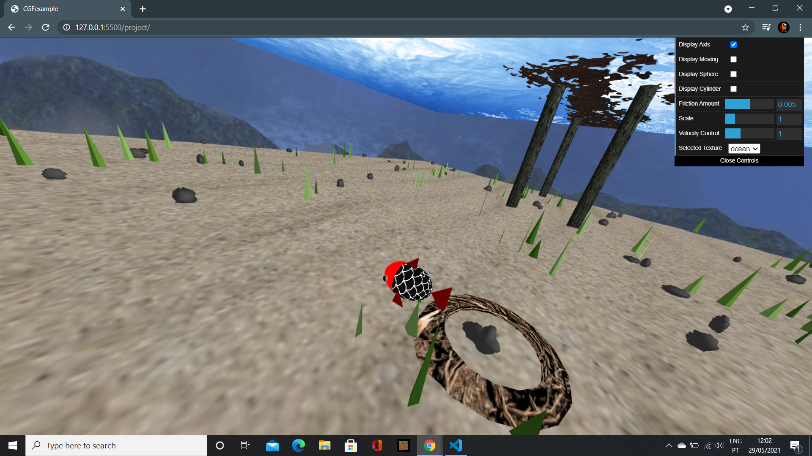
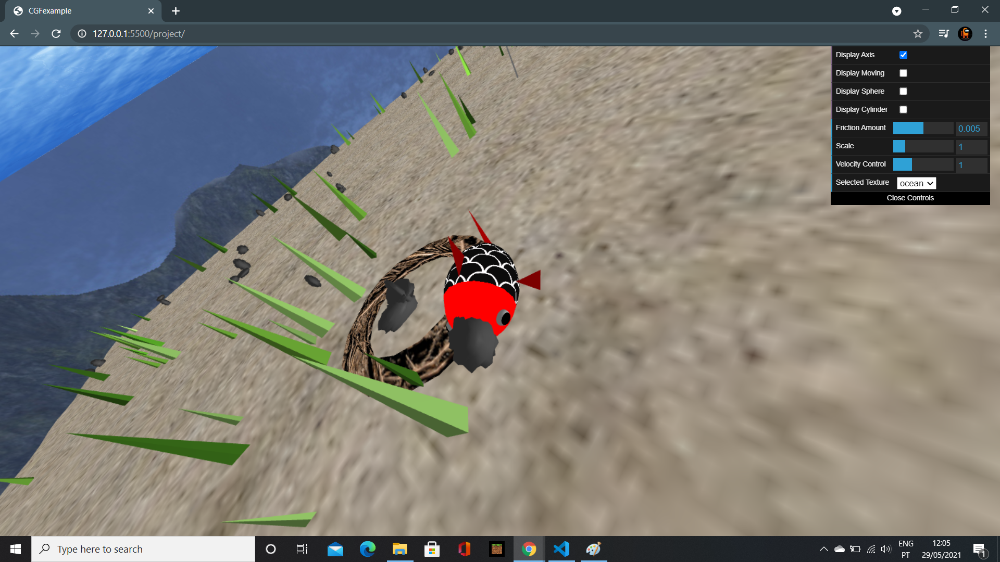
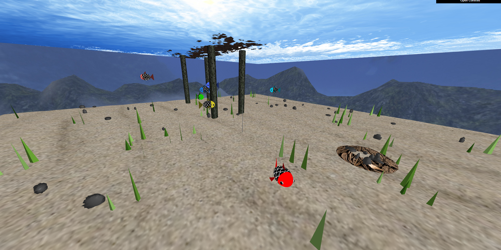

# CGRA 2020/2021

## Group T05G03
| Name             | Number    | E-Mail             |
| ---------------- | --------- | ------------------ |
| Afonso Monteiro | 201907284 | up201907284@fe.up.pt |
| Mário Travassos | 201905871 | up201905871@fe.up.pt |

## Project Notes
No que toca às funcionalidades adicionais, o nosso grupo implementou com sucesso aquelas descritas nos pontos 7.1, 7.3 e 7.5 da proposta do projeto.

Além disso, implementou-se uma classe própria para o ninho. 

## Screenshots

### 1 - My Fish

### 2 - Sea Floor

### 3 - Water Map

### 4 - Rocks

### 5 - Pillars

### 6 - Extra map elements

### 7 - Fish movement (collect and dispose)

### 8 - Extras implemented (randomness in the Seaweed and rocks in the nest)

